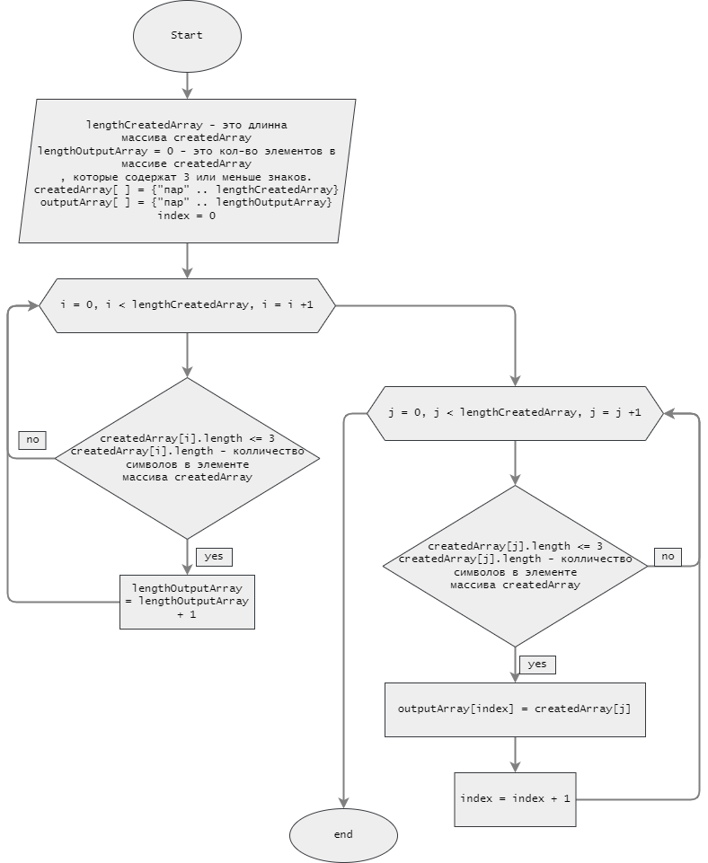

# Описание решения итоговой проверочной работы.
# Этапы:
1. Декомпозиция задания. Разбор задания на <подзадачи>

2. Создание блок-схемы. Создание блок схемы для метода решения <основной задачи>

3. Решение подзадач. Написание отдельного <метода> для каждой подзадачи.

4. Написание описания решения. Текстовое описание решения <файл README.md>

# Этап 1.
* Создать базовый массив
* Создать основной массив
* Заполнить основной массив случайными элементами из базового
* Решить основную задачу (по блок-схеме)
* Вывести результат в консоль
# Этап 2.

# Этап 3.
* Описываем Базовый массив.
* Создаем метод для создания Основного массива.
* Создаем метод для заполнения Основного массива, случайными элементами из Базового массива.
* Используя Random();.
* Создаем метод для решения Основной задачи.
* Сначала считаем сколько элементов с колличеством знаков меньше или рано 3, содержится в основном массиве.
* Затем создаем новый массив и записываем туда элементы с колличеством знаков меньше или рано 3, которые содержится в основном массиве.
* Создаем метод для вывода (печати) массива.
* Выводим результат в консоль.
* Основной массив -> [бег, Томск, гад, Уфа, ло]
* Сформированный массив -> [бег, гад, Уфа, ло]
# Этап 4.
Описываем все в README.md файле.